## THE SMART DORMITORY PROJECT

## Team: Nevena Nikolova, Antonio Iliev 
Video: https://vimeo.com/309069431
GitHub url: https://github.com/smartDormitory/smartDormitory.git

## Project purpose:
Following the best practices, studied at Telerik Academy Alpha and the ICB project requirements, 
we developed The Smart Dormitory project. The Smart Dormitory is an information system that collects data from various sensors located in college dormitories all over the world.
According to the requirements, the data will be analized by independent research organization to evaluate the living conditions and map them to the performance of the students.

## Project architecture:
The project has data, business and presentation layers. 
The data layer contains the domain models, the methods "Seed Api data" and "Seed users" and the dormitory system context. 
The business layer consists of the application services - sensor and user service, the background services and the hub service. 
We have used a background service, implementing the IHostedService interface from ASP.Net Core, for updating the Api sensors and their values in the database. The Timed Hosted Service checks for new sensors in the Api at every 12 hours and for outdated sensors in the database at every 5 sec.,by comparing the sum of each api sensor`s polling interval and time stamp to the current time. 
The presentation layer has public, private (accessible only from registered users) and administration parts.
Screenshots are provided below.

## Technologies:
ASP.Net Core MVC, MS SQL Server, EntityFramework, Bootstrap, SignalR, Ajax, Jquery, Unit Tests

## Class Diagram:
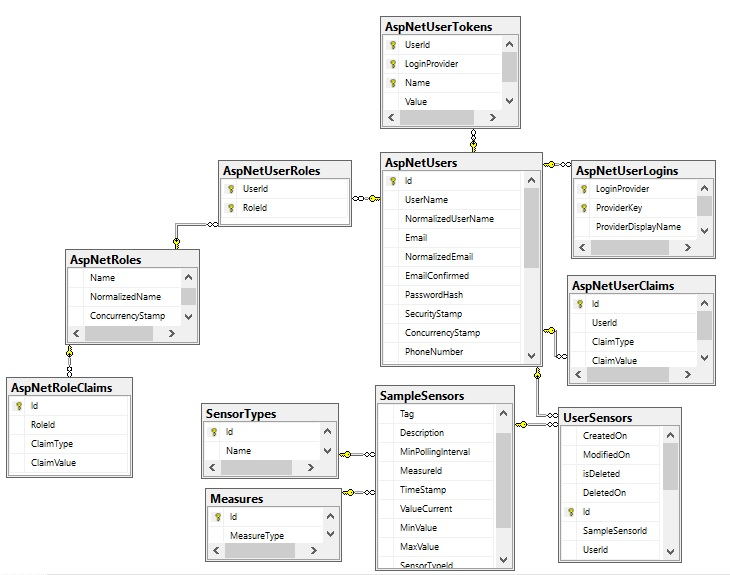

## Screenshots:
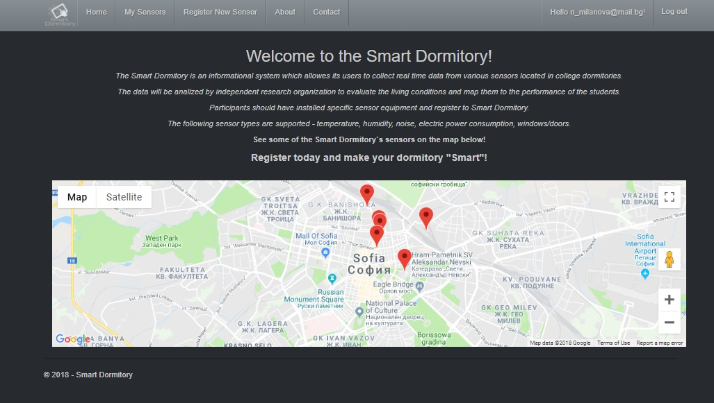
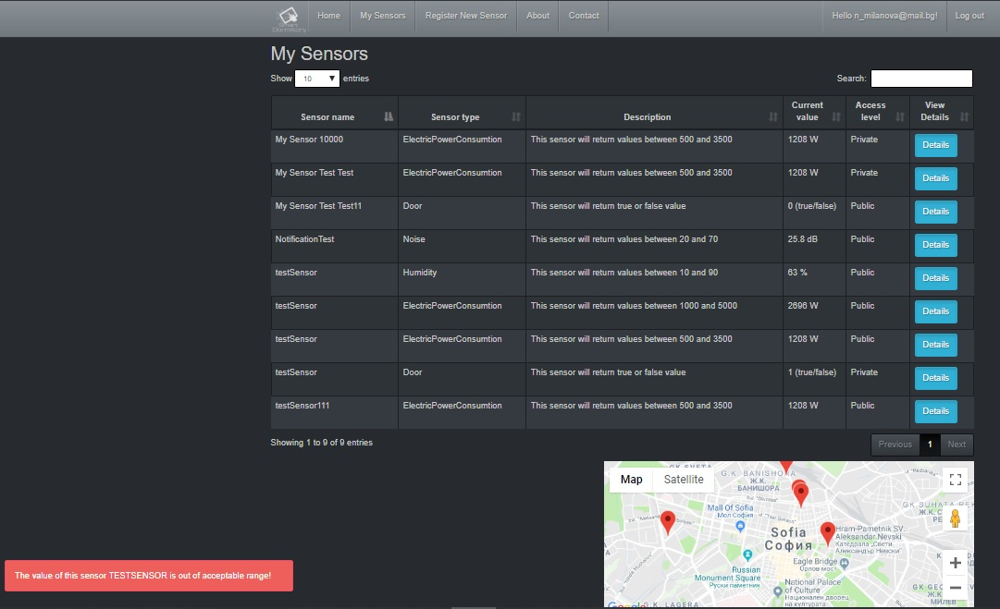
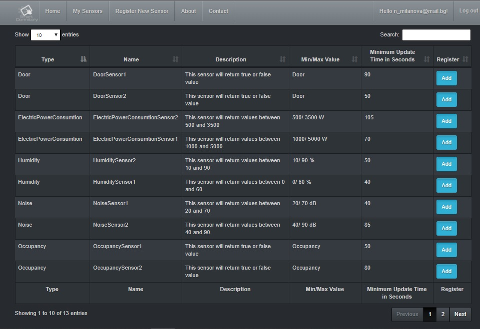
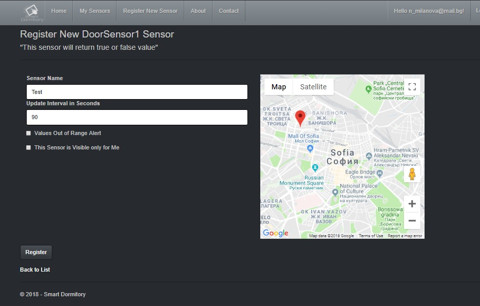
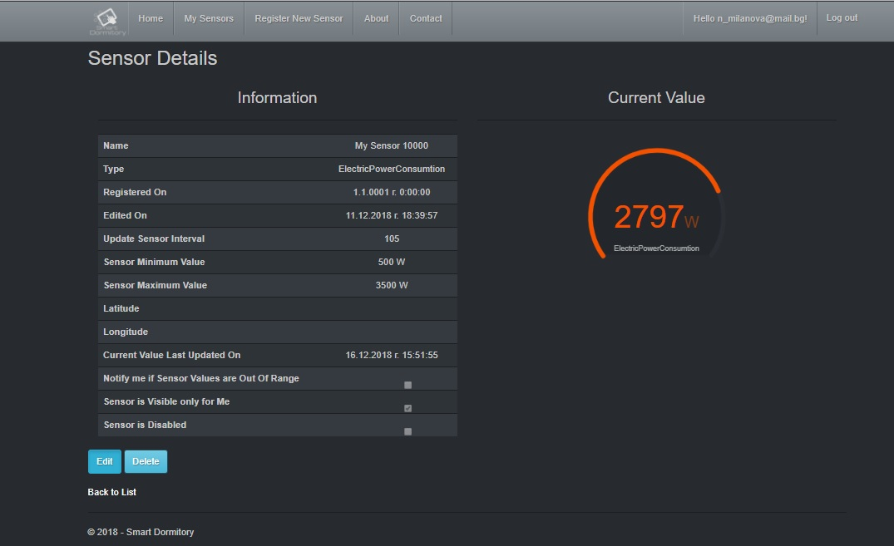
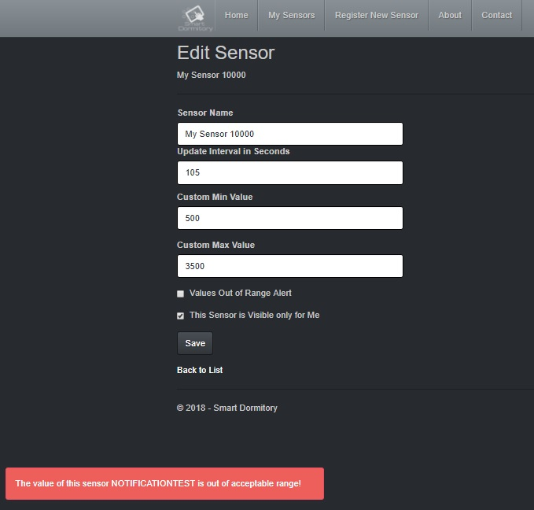
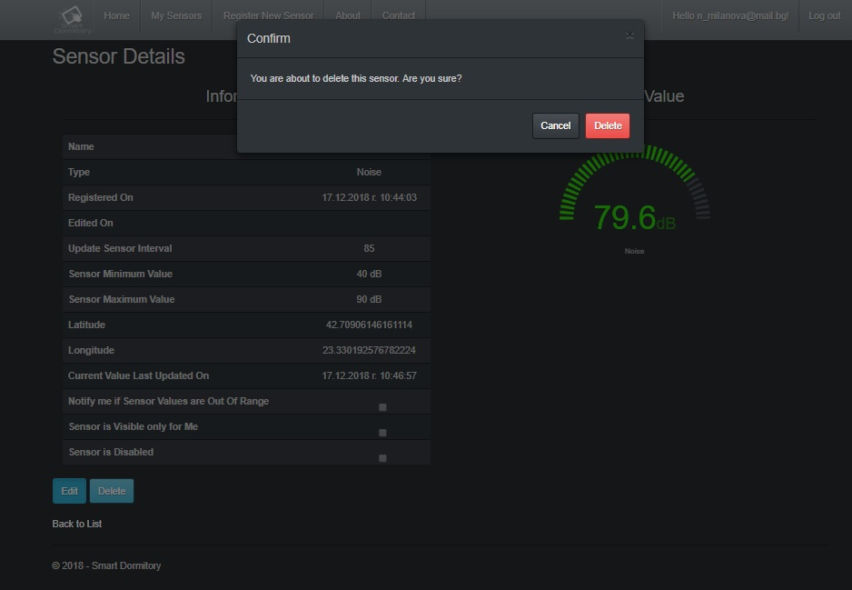
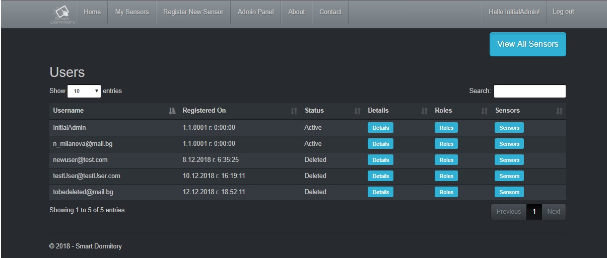
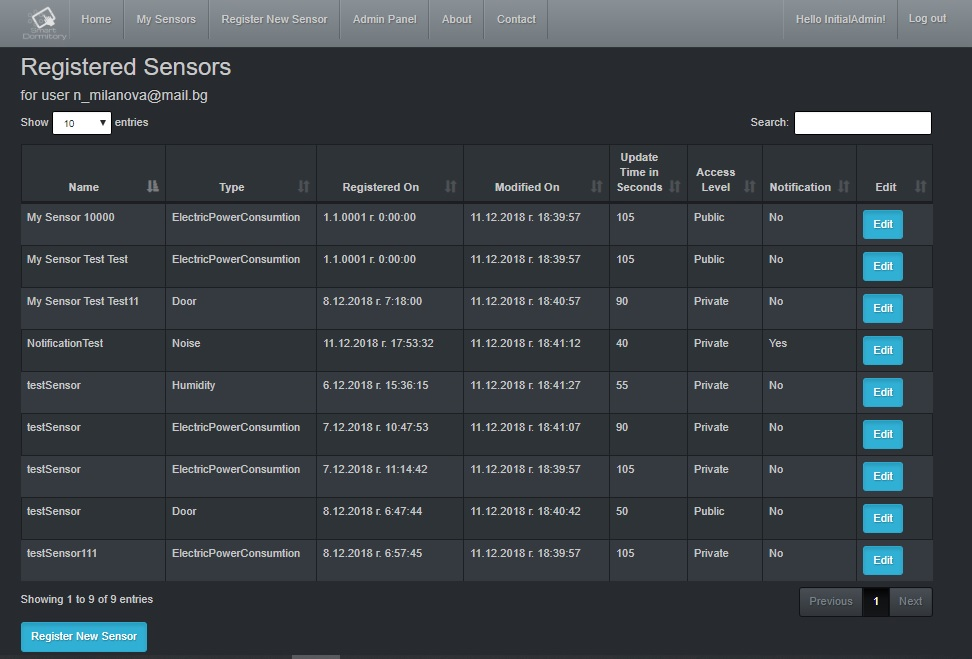
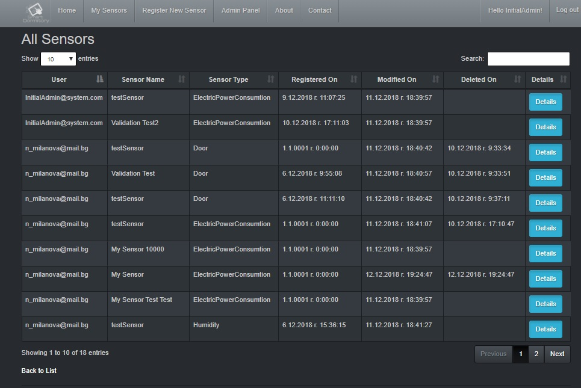

